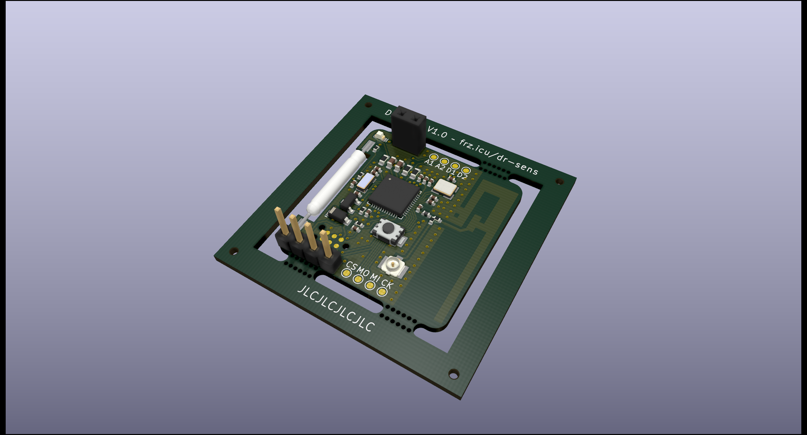

# "Dr. Sens" Door Contact

nRF52832-based magnetic door or window contact. It features a reed switch that triggers an interrupt pin of the MCU which then sends a message via Nordic's ESB protocol to a Gateway. The device is powered by a CR1632 battery cell. It is advisable to request an ack from the gateway (for obvious reasons) and resend the message until an ack is received or a certain number of attempts is reached.

The board also serves as breakout for i²C and SPI (pin assignment of nrf52-DK) and a pushbutton that is in parallel to the reed switch is populated. This is for development or so that the board can be used as a dashbutton, for example. There is a TX/RX header as well.

## Disclaimer
The board is still in development and I do not guarantee any functionality whatsoever. I do not recommend that you use this device to protect your property.