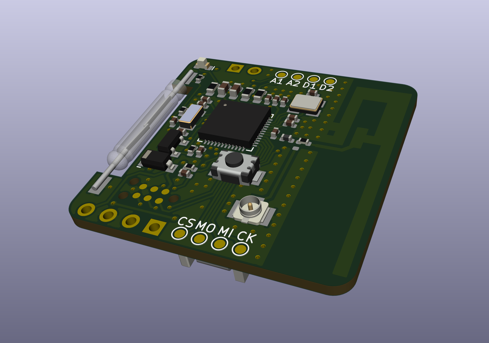
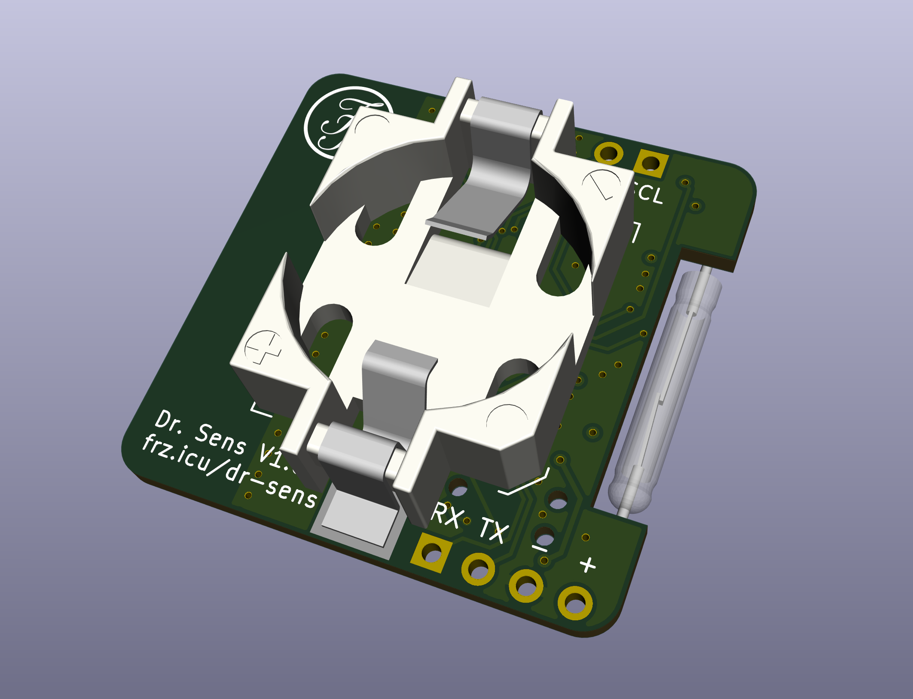

# "Dr. Sens" Door Contact

## Features
nRF52832-based magnetic door or window contact. It features a <strong>reed switch</strong> that triggers an interrupt pin of the MCU which then sends a message via <strong>Nordic's ESB protocol</strong> to a gateway. The device is powered by a <strong>CR1632 battery cell</strong>.

The board also serves as breakout for i²c and SPI (pin assignment of nrf52-DK) and a pushbutton that is in parallel to the reed switch is populated. This is for development and makes it possible that the board can <strong>be used as a dashbutton</strong>, for example, as well. There is a TX/RX header as well for easy debugging.

## Software
The software was written using the Arduino-Framework. For communication, the [MySensors Library](https://github.com/mysensors) is being used. The MCU goes to sleep until the interrupt is being triggered. After that, it sends a message (along with the battery charge status) to a gateway. When no ACK is received, the message is resend a set number of times.

## Renderings

## Disclaimer
The board is still in development and I do not guarantee any functionality whatsoever. I do not recommend that you use this device to protect your property.